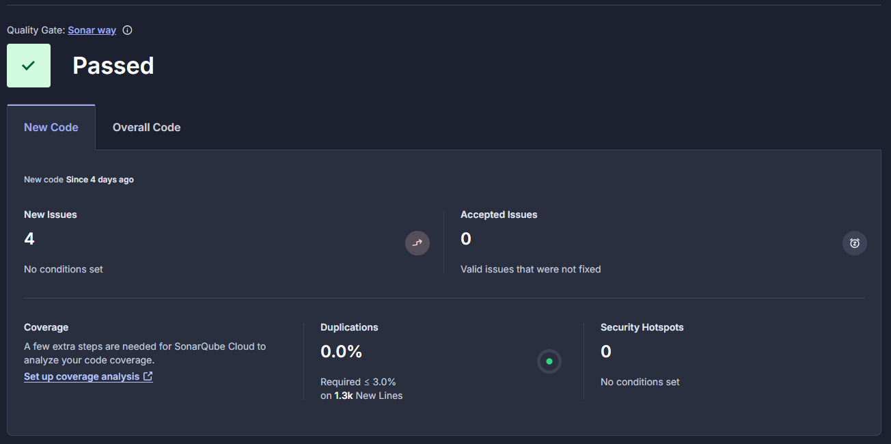
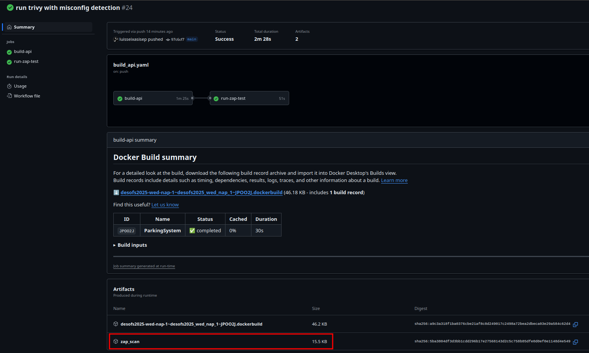
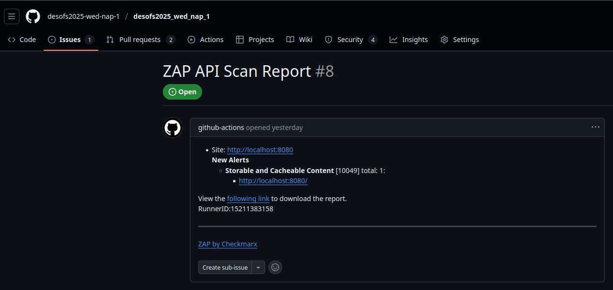
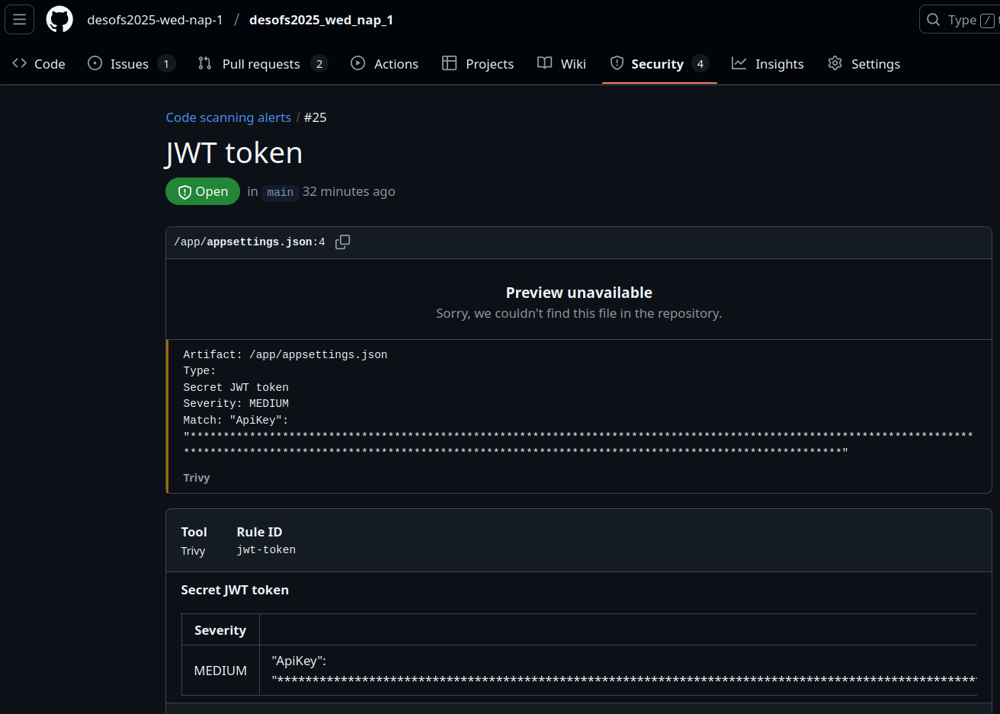
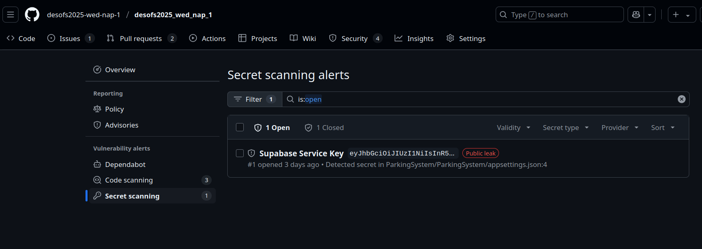
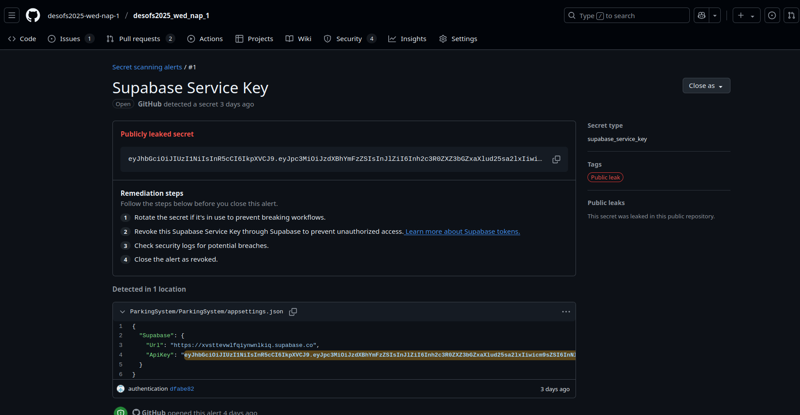

# DESOFS2025_WED_NAP_1 - Phase 2 - Sprint 1

This `README` file contains all information about developments that were done during the 1st Sprint of the 2nd Phase of
the DESOFS course unit Project.

## Development

### Authentication

The authentication system for this project is implemented using Supabase, which provides secure and scalable
authentication via JWT-based tokens. The system allows users to authenticate using their email and password, with the
credentials being validated through Supabase’s RESTful authentication endpoint.

The application integrates this flow using a custom service `SupabaseAuthService` that sends login requests to
Supabase’s `/auth/v1/token` endpoint with the appropriate API key and credentials. Upon successful authentication,
Supabase returns a JWT token and user data, which are then used to authorize access to protected resources throughout
the system.

The authentication controller `AuthController` exposes an endpoint ` /api/auth/login` which handles login requests. The
token returned can then be used by the frontend or client to access other secured endpoints. The JWT is also validated
on every request via the built-in JwtBearer middleware in ASP.NET Core, using the Supabase URL as the authority.

This approach removes the burden of handling password encryption, session storage, and token issuance, delegating it to
a trusted third-party authentication provider.

The following image shows the tables created in Supabase:


User created to test the authentication system:


---

### Developed Use Cases

### Coding best practices

In order to achieve a clear organization of the secure development process, we've defined a set of best practices that
we must undertake when contributing to this project.

Firstly, we will adopt development branches, meaning that no application code should be commited directly to the main
branch without previous review. Whenever a developer considers the code to be appropriate for a merge to the main
branch, he/she will open a Pull Request (PR), which will have to be reviewed and approved by another member of the team
prior to merging with main. If the reviewer finds any issues or has suggestions to improve the code, these should be
specifically commented so that the original PR author can review them and fix them in the code. These fixes will then be
reviewed by a reviewer, and merged to the main branch if no further issues are found.

Additionally, the merge of a PR can only be approved if the defined tests to the application are passing with success,
and if no Critical vulnerabilities are found. These tests/vulnerability checks are handled automatically by GitHub
workflows - which will be explained further in this report.

Finally, we've taken into consideration
the [Coding Conventions and best practices for C#](https://learn.microsoft.com/en-us/dotnet/csharp/fundamentals/coding-style/coding-conventions)
as defined by Microsoft - the maintainers of the language - in order to achieve a cohesive coding pattern throughout all
elements of the application.

### Static Code Analysis

To ensure our code quality, maintainability, and security, we integrated **SonarCloud** into our development pipeline.
SonarCloud automatically analyzes our C# codebase on each push to the `main` branch using a GitHub Actions workflow.

The workflow performs the following steps:

- **Checkout code and setup environment**

```yaml
- name: Checkout code
  uses: actions/checkout@v4

- name: Setup .NET
  uses: actions/setup-dotnet@v4
  with:
    dotnet-version: '8.0.x'  
```

- **Install SonarScanner tool and configure PATH**

```yaml
- name: Install dotnet-sonarscanner
  run: dotnet tool install --global dotnet-sonarscanner

- name: Add dotnet tools to PATH
  run: echo "$HOME/.dotnet/tools" >> $GITHUB_PATH
```

- **Begin SonarCloud analysis**

```yaml
- name: Begin SonarCloud analysis
  working-directory: ParkingSystem/ParkingSystem
  run: >
    dotnet-sonarscanner begin
    /k:"JoanaGMoreira_desofs2025_wed_nap_1"
    /o:"joanagmoreira"
    /d:sonar.token="${{ secrets.SONAR_TOKEN }}"
    /d:sonar.host.url="https://sonarcloud.io"
```

- **Restore dependencies and build solution**

```yaml
- name: Restore dependencies
  working-directory: ParkingSystem/ParkingSystem
  run: dotnet restore ParkingSystem.sln

- name: Build solution
  working-directory: ParkingSystem/ParkingSystem
  run: dotnet build ParkingSystem.sln --no-restore --no-incremental
```

- **End SonarCloud analysis**

```yaml
- name: End SonarCloud analysis
  working-directory: ParkingSystem/ParkingSystem
  run: dotnet-sonarscanner end /d:sonar.token="${{ secrets.SONAR_TOKEN }}"
```

SonarCloud provides continuous feedback on:

- Code smells
- Bugs
- Security vulnerabilities
- Test coverage

All team members are encouraged to regularly check SonarCloud reports and fix identified issues as part of the
development process.

Below is an example of a SonarCloud report generated during this sprint:



### Software Composition Analysis

A Software Bill of Materials (SBOM) is a comprehensive inventory of all software components, libraries, and dependencies
used in a given project.
An SBOM helps identify exactly what is included in a software build. This is crucial for security, compliance, and
supply chain transparency, especially as organizations face increasing demands to detect and address vulnerabilities
quickly.

In our project, we generate an SBOM using the CycloneDX specification, which is widely supported and integrates well
with modern development tools.
Our application, written in .NET 8, uses various third-party packages, making it important to capture this dependency
information in a structured and machine-readable way.
We use the CycloneDX .NET CLI tool to scan the project file (.csproj) and produce a JSON-formatted SBOM that lists all
relevant packages and metadata.

We then use this JSON file to track dependencies, identify potential vulnerabilities, and ensure compliance with
licensing requirements. This File can also be used to generate different formats, such as XML, or given to processors to
generate visualizations of the dependencies.

| Component Name                                    | Version | License | Description                                          |
|---------------------------------------------------|---------|---------|------------------------------------------------------|
| Microsoft.AspNetCore.Authentication.JwtBearer     | 8.0.0   | MIT     | Enables app to receive OpenID Connect bearer tokens  |
| Microsoft.Extensions.ApiDescription.Server        | 6.0.5   | MIT     | Swagger/OpenAPI document generation tools            |
| Microsoft.Extensions.Configuration                | 9.0.5   | MIT     | Key-value pair configuration provider                |
| Microsoft.Extensions.Configuration.Abstractions   | 9.0.5   | MIT     | Abstractions for configuration (interfaces, etc.)    |
| Microsoft.Extensions.Configuration.FileExtensions | 9.0.5   | MIT     | File-based config providers for configuration system |
| Microsoft.Extensions.Configuration.Json           | 9.0.5   | MIT     | JSON config file reader for configuration system     |
| Microsoft.Extensions.FileProviders.Abstractions   | 9.0.5   | MIT     | Abstractions for files and directories               |
| Microsoft.Extensions.FileProviders.Physical       | 9.0.5   | MIT     | File provider for physical files                     |
| Microsoft.Extensions.FileSystemGlobbing           | 9.0.5   | MIT     | Pattern matching for file systems                    |
| Microsoft.Extensions.Primitives                   | 9.0.5   | MIT     | Shared framework primitives                          |
| Microsoft.IdentityModel.Abstractions              | 7.0.3   | MIT     | Thin abstractions for Microsoft.IdentityModel        |
| Microsoft.IdentityModel.JsonWebTokens             | 7.0.3   | MIT     | JSON Web Token creation, validation                  |
| Microsoft.IdentityModel.Logging                   | 7.0.3   | MIT     | Event source based logging support                   |
| Microsoft.IdentityModel.Protocols                 | 7.0.3   | MIT     | Protocol support for OpenIdConnect, WsFederation     |
| Microsoft.IdentityModel.Protocols.OpenIdConnect   | 7.0.3   | MIT     | OpenIdConnect protocol support                       |
| Microsoft.IdentityModel.Tokens                    | 7.0.3   | MIT     | Security token operations (signing, encryption)      |
| Microsoft.OpenApi                                 | 1.2.3   | Unknown | .NET models for OpenAPI (JSON/YAML)                  |
| Swashbuckle.AspNetCore                            | 6.4.0   | MIT     | Swagger tools for ASP.NET Core                       |
| Swashbuckle.AspNetCore.Swagger                    | 6.4.0   | MIT     | Middleware to expose Swagger JSON                    |
| Swashbuckle.AspNetCore.SwaggerGen                 | 6.4.0   | MIT     | Swagger document generator                           |
| Swashbuckle.AspNetCore.SwaggerUI                  | 6.4.0   | MIT     | Swagger UI middleware                                |
| System.IdentityModel.Tokens.Jwt                   | 7.0.3   | MIT     | JWT creation, serialization, validation              |
| System.IO.Pipelines                               | 9.0.5   | MIT     | High-performance pipe APIs                           |
| System.Text.Encodings.Web                         | 9.0.5   | MIT     | String encoding for HTML/JS/URL                      |
| System.Text.Json                                  | 9.0.5   | MIT     | JSON serialization/deserialization for .NET          |

To ensure consistency and to streamline our development pipeline, SBOM generation is automated using GitHub Actions.
This process is triggered manually using workflow_dispatch, making it easy for developers to generate and download the
SBOM at any time.

The workflow performs the following steps:

1. Check out the project repository.

2. Set up the .NET 8 SDK environment.

3. Restores dependencies from the .csproj file.

4. Installs the CycloneDX CLI tool globally.

5. Generate the SBOM by running dotnet CycloneDX, targeting the main project file.

6. Uploads the SBOM artifact to GitHub so it can be reviewed or used in downstream processes (e.g., license compliance
   checks or vulnerability scans).

This automation ensures that our SBOM is always up to date with the latest project state and reduces the risk of manual
errors or omissions.

```YAML
name: Generate SBOM

on:
  workflow_dispatch:

jobs:
  generate-sbom:
    runs-on: ubuntu-latest

    steps:
      - name: Checkout code
        uses: actions/checkout@v3

      - name: Set up .NET
        uses: actions/setup-dotnet@v4
        with:
          dotnet-version: '8.0'

      - name: Restore dependencies
        working-directory: ParkingSystem/ParkingSystem
        run: dotnet restore

      - name: Install CycloneDX tool
        run: dotnet tool install --global CycloneDX

      - name: Generate SBOM
        working-directory: ParkingSystem/ParkingSystem
        run: dotnet CycloneDX ParkingSystem.csproj --output ./sbom --json

      - name: Upload SBOM artifact
        uses: actions/upload-artifact@v4.6.2
        with:
          name: sbom
          path: ParkingSystem/ParkingSystem/sbom
```

## Build and Test

This section will describe the build and test procedure for the application, highlighting relevant procedures.

### Build process

To build our application in a repeatable and efficient way, we chose to adopt Docker - thus, our main artifact is a
Docker image. This image is built based on our [`Dockerfile`](../../../ParkingSystem/Dockerfile), which itself uses two
Microsoft images (with our project being developed in C# and using the .NET framework):

1. Firstly, `dotnet/sdk:8.0` is used to build the application using the necessary `dotnet publish` command, which
   generates the applicational artifacts in the `out/` directory.
2. The `aspnet:8.0` image is used to actually execute the application, using the ASP.NET framework. Here,
   `ParkingSystem.dll` is extracted from the build process and executed via the `ENTRYPOINT` instruction.

This process is not manual, but rather done in a fully automatic way via the usage of GitHub workflows. Notably, the [
`build_api.yaml`](../../../.github/workflows/build_api.yaml) is responsible for doing this whenever a pull request to
the main branch is created.

The workflow logs in Docker Hub, using a username and password which are stored in the repository as **GitHub secrets
** - thus, not being exposed in clear-text anywhere in the repository's code. Then, it uses the
`docker/build-push-action@v6` action available in the Marketplace to build the above-mentioned Dockerfile, tag it with
the `lew6s/parking-system:0.0.1`, and push it to Docker Hub. The app version is set as `0.0.1` for the time being, and
is sourced from an environment variable specified in the workflow.

The mentioned workflow contains other actions for distinct purposes, which will be explained further in this report.

### Execution of test plans

(falar dos testes aplicacionais que temos e de como são executados - por meio de workflow)

### Artifact Scanning

After the build process mentioned prior, we conduct artifact scanning to identify vulnerabilities in the generated
artifact. For this use case, we adopted the usage of **Trivy**, which is able to scan Docker images and report on
findings. Like other processes, this is fully automated via a GitHub workflow called [
`build_api.yaml`](../../../.github/workflows/build_api.yaml).

In it, the `aquasecurity/trivy-action@0.28.0` GitHub action is used to scan the Docker image artifact after it has been
published to Docker Hub:

```YAML
- name: Scan built Docker image with Trivy
  uses: aquasecurity/trivy-action@0.28.0
  with:
    image-ref: 'lew6s/parking-system:${{ env.VERSION }}'
    format: 'sarif'
    output: 'trivy-results.sarif'
    exit-code: '0'
    ignore-unfixed: true
    vuln-type: 'os,library'
    scanners: 'vuln,secret,misconfig'
    severity: 'MEDIUM,HIGH,CRITICAL'
```

This job conducts the scan and generates an output file called `trivy-results.sarif`, which contains a report of the
vulnerabilities that were found. These findings are then published to the GitHub security tab via the following job
step:

```YAML
- name: Upload Trivy scan results to GitHub Security tab
  uses: github/codeql-action/upload-sarif@v3
  with:
    sarif_file: 'trivy-results.sarif'
```

Below, we can see an example of the findings reported by Trivy:


### Dynamic Analysis

After conducting the artifact scan, we run a dynamic analysis of the application. For this, we used the `OWASP ZAP`
tool. Notably, we used the `zaproxy/action-api-scan@v0.9.0` GitHub action, which specifically conducts a scan for Web
APIs - unlike other OWASP ZAP scans. These tests are fully automated through the [
`build_api.yaml`](../../../.github/workflows/build_api.yaml) workflow.

Since we currently don't have a production deployment of the application, the aforementioned Docker image is executed as
a service container for this job, making it so that it's accessible by the job itself on the `localhost` of the runner:

```YAML
services:
  api:
    image: 'lew6s/parking-system:0.0.1'
    ports:
      - 8080:8080
```

Then, we have a step which runs the ZAP API scan, targeting the application's container:

```YAML
steps:
  - name: Run ZAP test targeting API
    uses: zaproxy/action-api-scan@v0.9.0
    with:
      target: 'http://localhost:8080/'
```

This action generated a report, which is set as an artifact on the build itself:



However, for convenience and further analysis of the findings, it also opens a **GitHub issue** which reports the
findings, so that the team can look into and fix them:



If this issue is not resolved, it's updated with new findings (if that's the case) whenever the job executes.

### Configuration Validation

As seen in the **Artifact Scanning** section, Trivy is executed with the `misconfiguration` scan profile enabled, which
makes it so that the configuration elements of the application are also automatically scanned. This is handled by the *
*same workflow job and step**, so that explanation won't be repeated here.

On the security tab, **Trivy** also includes security issues related to configuration. Below is an example of this:



Besides Trivy, we also have **GitHub Secret scanning** enabled, which scans the repository for secrets that are in
clear-text, and alerts us of this fact - as this is considered a configuration flaw. Below is the list of findings
discovered by this tool:



Each specific issue (in this case we only have one) documents what type of secret was found, where it's located, and the
steps to undertake in order to remediate the vulnerability - usually consists of secret rotation on the secret's
provider (Supabase, in this example) and further removal from the code:



## Pipeline Automation

(isto meio que já foi falado nos restantes pontos, portanto acho que é brevemente repetir que todos estes processos
estão automatizados por meio de GitHub workflows)

## ASVS Checklist

(colar resultados gerados)

